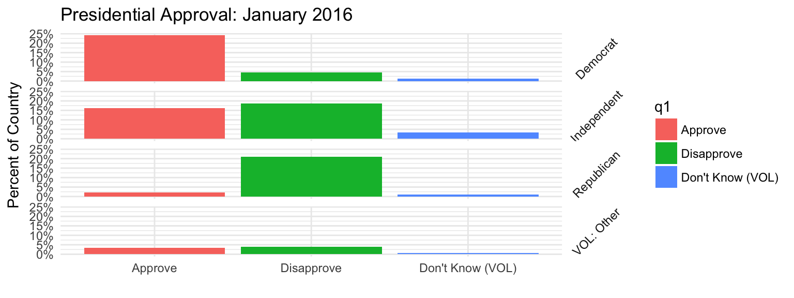

Automating Summary of Surveys with RMarkdown
================
Pete Mohanty

This guide shows how to automate the summary of surveys with `R` and `RMarkdown` using `RStudio`. This is great for portions of the document that don't change (e.g., "the survey shows substantial partisan polarization"). The motivation is really twofold: *efficiency* (maximize the reusabililty of code, minimize copying and pasting errors) and *reproducability* (maximize the number of people and computers that can reproduce findings).

The basic setup is to write an `Rmd` file that will serve as a template and then a short `R` script that loops over each data file (using `library(knitr)`). The `render` function then turns the `Rmd` into documents or slides (typically in `PDF`, `HTML`, or `docx`) by taking file metadata as a [parameter](http://rmarkdown.rstudio.com/developer_parameterized_reports.html).

There are countless ways to summarize a survey in `R`. This guide shows a few basics with `ggplot` and `questionr` but focuses on the overall workflow (file management, etc.). Following the instructions here, you should be able to reproduce all four reports (and in principle, many more) despite only writing code to clean one survey. Most of the code is displayed in this document but all code is found in either `pewpoliticaltemplate.Rmd` or `pew_report_generator.R`. All code, as well the outputted documents, can be found [here](https://github.com/rdrr1990/datascience101/tree/master/automating) and details on obtaining the data are found below.

Software
========

`RStudio`'s interface with `library(rmarkdown)` is evolving rapidly. Installing the current `RStudio` is highly recommended, particularly for the previews of the `RMarkdown` code (this doc was created with `RStudio 1.1.83`). (Here is my [install guide](stats101.stanford.edu), which includes links to tutorials and cheat sheets. For somewhat more advanced survey data cleaning, click [here](stats101.stanford.edu/R_skill_dRill.html).)

Even if you've knit `Rmd` already, your libraries may not be new enough to create parameterized reports. I recommend installing `pacman`, which has a convenience function `p_load` that smooths package installation, loading, and maintenance. I'd recommend `p_load` particularly if you are collaborating say on `Dropbox`.

``` r
install.packages("pacman")
p_load(rmarkdown, knitr, foreign, scales, questionr, tidyverse, update = TRUE)
```

Remember `PDF` requires `LaTeX` [(install links)](stats101.stanford.edu). By contrast, knitting to `docx` or `HTML` does not require `LaTeX`. Creating `pptx` is possible with `R` with `library(ReporteRs)` but not discussed here.

The Data
========

Download the four "political surveys" from Pew Research available [here](http://www.people-press.org/datasets/2016/) (i.e., January, March, August, and October 2016). You may recall, some politics happened in 2016. (The data is free provided you take a moment to make an account.)

-   If need be, decompress each `zip` folder.

Three of my folders have intuitive names (`Jan16`, `Mar16`, and `Oct16`) but one of my folders picked up a lengthy name, `http___www.people-press.org_files_datasets_Aug16`. Don't worry about that.

-   Create a new folder, call it say `automating`

-   Move all four data folders into `automating`

Please note I have no affiliation (past or present) with Pew Research. I simply think that they do great work and they make it relatively hassle free to get started with meaningful data sets.

The R Notebook (RMarkdown) Template
===================================

(RMarkdown ninjas can skip this section.)

In `RStudio`, create a new `RNotebook` and save it as `pewpoliticaltemplate.Rmd` in the `automating` folder you just created. This document will likely knit to `HTML` by default; hold down the `knit` button to change it to `PDF`. Add fields to the header as desired. The sample header below automatically puts today's date on the document by parsing the expression next to `Date:` as `R` code. `classoption: landscape` may help with wide tables. You can also specify the file that contains your bibliography in several formats such as `BibTex` and `EndNote` [(citation details)](http://rmarkdown.rstudio.com/authoring_bibliographies_and_citations.html).

Next add an `R` code chunk to `pewpoliticaltemplate.Rmd` to take care of background stuff like formatting. Though setting a working directory would not be needed just to knit the `Rmd`, the directory must be set by `knitr::opts_knit$set(root.dir = '...')` to automate document prep. (`setwd` isn't needed in the `Rmd` but setting the working directory separately in `Console` is recommended if you're still editing.)


The play button at the top right gives a preview of the code's output, which is handy. If some part of the analysis is very lengthy, it only needs to be run once, freeing you to tinker with graphics and the like.

-- Now the default settings have been set and you don't need to worry about suppressing warnings and so on with each code chunk. You can of course change them case-by-case as you like.

-- Unlike in `R`, when setting the format options for individual code chunks (as shown above to suppress warnings before the defaults kick in), you do need to type out the words `TRUE` and `FALSE` in full.

-- Unlike the template, in this doc, I've set the defaults to `echo = TRUE` and `tidy = TRUE` to display the `R` code more pleasingly.

-- The setting `asis = TRUE` is very useful for professionally formatted tables (show below) but is not recommendable for raw R output of matrix and tables. To make raw data frames display with `kable` by default, see [here](http://rmarkdown.rstudio.com/html_document_format.html).

### The Template

I find it easiest to write a fully working example and then make little changes as needed so that `knitr::render()` can loop over the data sets. First things first.

``` r
survey <- read.spss("Jan16/Jan16 public.sav", to.data.frame = TRUE)
```

Summary stats can easily be inserted into the text like so.


The template contains additional examples with survey weights (lengthier calculations should be done in blocks of code and then their result referred with that inline style).

Here is a basic plot we might want, which reflects the survey weights. `facet_grid()` is used to create analogous plots for each party identification. The plot uses the slightly wonky syntax `y = (..count..)/sum(..count..)` to display the results as percentages rather than counts. Note some code that cleans the data (mostly shortening labels) is omitted for brevity but can be found [here](https://github.com/rdrr1990/datascience101/blob/master/automating/pewpoliticaltemplate.Rmd).

``` r
PA <- ggplot(survey) + theme_minimal()
PA <- PA + geom_bar(aes(q1, y = (..count..)/sum(..count..), weight = weight, 
    fill = q1))
PA <- PA + facet_grid(party.clean ~ .) + theme(strip.text.y = element_text(angle = 45))
PA <- PA + xlab("") + ylab("Percent of Country")
PA <- PA + ggtitle("Presidential Approval: January 2016")
PA <- PA + scale_y_continuous(labels = scales::percent)
PA
```



Here is an example of a weighted crosstab. `knitr::kable` will create a table that's professional in appearance (when knit as `PDF`, `kable` takes the style of an academic journal).

``` r
kable(wtd.table(survey$ideo, survey$sex, survey$weight)/nrow(survey), digits = 2)
```

|                   |  Male|  Female|
|-------------------|-----:|-------:|
| Very conservative |  0.04|    0.03|
| Conservative      |  0.14|    0.13|
| Moderate          |  0.20|    0.20|
| Liberal           |  0.08|    0.09|
| Very liberal      |  0.03|    0.03|
| DK\*              |  0.02|    0.03|

Suppose we want Presidential approval where the columns provide first overall approval and subsequent columns are crosstabs for various factors of interest (using the cell phone weights). I've written a convenience function called [Xtabs](https://github.com/rdrr1990/datascience101/blob/master/automating/Xtabs.R) that creates this format, which is common in the survey world.

``` r
source("https://raw.githubusercontent.com/rdrr1990/datascience101/master/automating/Xtabs.R")
kable(Xtabs(survey, "q1", c("sex", "race"), weight = "cellweight"))
```

|                  | Overall | Male  | Female | White (nH) | Black (nH) | Hispanic | Other  | DK\*   |
|------------------|:--------|:------|:-------|:-----------|:-----------|:---------|:-------|:-------|
| Approve          | 45.6%   | 21.3% | 24.2%  | 20.4%      | 9.48%      | 10.2%    | 4.97%  | 0.443% |
| Disapprove       | 48.5%   | 25.5% | 23%    | 39.6%      | 1.33%      | 3.95%    | 2.53%  | 1.12%  |
| Don't Know (VOL) | 5.94%   | 2.67% | 3.27%  | 3.39%      | 0.646%     | 1.14%    | 0.489% | 0.269% |

Suppose we want to do many crosstabs. The syntax `survey$ideo` is widely used for convenience but `survey[["ideo"]]` will serve us better since it allow to work with vectors of variable names ([details from win-vector](http://www.win-vector.com/blog/2017/06/non-standard-evaluation-and-function-composition-in-r/)). Below, the first two calls to comparisons are identical but the final one is not because there is no variable "x" in the data frame `survey`.

``` r
identical(survey$ideo, survey[["ideo"]])
```

    [1] TRUE

``` r
x <- "ideo"
identical(survey[[x]], survey[["ideo"]])
```

    [1] TRUE

``` r
identical(survey[[x]], survey$x)
```

    [1] FALSE

So say we want weighted crosstabs for ideology and party id crossed by all question 20, 21, 22.. 29. Here is some code that will do that.

``` r
x <- names(survey)[grep("q2[[:digit:]]", names(survey))]
x
```

     [1] "q20"  "q21"  "q22a" "q22b" "q22c" "q22d" "q22e" "q22f" "q22g" "q22h"
    [11] "q22i" "q25"  "q26"  "q27"  "q28" 

``` r
y <- c("ideo", "party")
```

``` r
for (i in x) {
    for (j in y) {
        cat("\nWeighted proportions for", i, "broken down by", j, "\n")
        print(kable(wtd.table(survey[[i]], survey[[j]], survey$weight)/nrow(survey), 
            digits = 2))
        cat("\n")  # break out of table formatting
    }
    cat("\\newpage")
}
```

A few notes:

-- This code will only work with the `asis` setting (shown above) that lets `knitr` interpret the output of `print(kable())` as something to render (rather than just `Markdown` code to display for use elsewhere).

-- Ideally one would have a `csv` or `data.frame` of the questions and display the as loop switched questions. In this case, the questionnaire is in a `docx` and so `library(docxtrackr)` may help.

-- Rather than a nested loop, one would likely prefer to pick a question, loop over the demographic and ideological categories for the crosstabs, and then insert commentary and overview.

-- The outer loops makes a new page each time it is done with the inner loop with `cat("\\newpage"))`, which is specific to rendering as `PDF`. Extra line breaks `\n` are needed to break out of the table formatting and keep code and text separate. A different approach to page breaks is needed [for docx](https://stackoverflow.com/questions/24672111/how-to-add-a-page-break-in-word-document-generated-by-rstudio-markdown).

Adapting the Template with Parameters
=====================================

The next step is to add a [parameter](http://rmarkdown.rstudio.com/developer_parameterized_reports.html) with any variables you need. The parameters will be controlled by the `R` script discussed below. There is of course quite a bit of choice as to what is controlled by which file but often only a handful of parameters are necessary. Add the following to the end of the header of `pewpoliticaltemplate.Rmd`:

    params:
      spssfile: !r  1
      surveywave: !r 2016


That creates variables `params$spssfile` and `params$surveywave` that can be controlled externally from other `R` sessions and gives them default values of `1` and `2016`. Setting default values smooths debugging by allowing you to continue knitting the `Rmd` on its own (as opposed to from the `R` script we will create in a moment... You can also click on `knit` and choose `knit with parameters` to specify particular values).

Now make any changes to `Rmd` template. For example, in the `ggplot` code...

``` r
PA <- PA + ggtitle(paste("Presidential Approval:", params$surveywave))
```

Notice we can get a list of all the `spss` files like so:

``` r
dir(pattern = "sav", recursive = TRUE)
```

    [1] "http___www.people-press.org_files_datasets_Aug16/Aug16 public.sav"
    [2] "Jan16/Jan16 public.sav"                                           
    [3] "March16/March16 public.sav"                                       
    [4] "Oct16/Oct16 public.sav"                                           

or in this case

``` r
dir(pattern = "16 public.sav", recursive = TRUE)
```

    [1] "http___www.people-press.org_files_datasets_Aug16/Aug16 public.sav"
    [2] "Jan16/Jan16 public.sav"                                           
    [3] "March16/March16 public.sav"                                       
    [4] "Oct16/Oct16 public.sav"                                           

I recommend making the pattern as specific as possible in case you or your collaborators add other `spss` files with similar names. To use regular expressions to specify more complicated patterns, see [here](https://rstudio-pubs-static.s3.amazonaws.com/74603_76cd14d5983f47408fdf0b323550b846.html).

Now back to editing `pewpoliticaltemplate.Rmd`...


Knit the file to see how it looks with these default settings; that's it for this portion.

Automating with knitr
=====================

Now create a new `R` script; mine's called `pew_report_generator.R`. It's just a simple loop that tells which data set to grab as well as the label to pass to the `Rmd`. Note that the labels appear in alphabetical rather than chronological order as a function of the way that the `Rmd` happens to find the files.

``` r
library(pacman)
p_load(knitr, rmarkdown, sessioninfo)

setwd("/users/mohanty/Desktop/pewpolitical/")

waves <- c("August 2016", "January 2016", "March 2016", "October 2016")

for (i in 1:length(waves)) {
    render("pewpoliticaltemplate.Rmd", params = list(spssfile = i, surveywave = waves[i]), 
        output_file = paste0("Survey Analysis ", waves[i], ".pdf"))
}

session <- session_info()
save(session, file = paste0("session", format(Sys.time(), "%m%d%Y"), ".Rdata"))
```

That's it. Of course, in practice you might write some code on the first survey that doesn't work for all of them. Pew, for example, seems to have formatted the survey date differently in the last two surveys which led me to make a few changes. But if the data are formatted fairly consistently, a one-time investment can save massive amounts of time lost to error prone copying and pasting.

### A Little Version Control

The last bit of code is not necessary but is a convenient way to store which versions of which libraries were actually used on which version of R. If something works now but not in the future `install_version` (found in `library(devtools)`) can be used to install the older version of particular packages.

``` r
s <- session_info()
s$platform
```

     setting  value                       
     version  R version 3.4.2 (2017-09-28)
     os       macOS Sierra 10.12.6        
     system   x86_64, darwin15.6.0        
     ui       X11                         
     language (EN)                        
     collate  en_US.UTF-8                 
     tz       America/Los_Angeles         
     date     2017-11-27                  

``` r
s$packages[1:5, ]
```

     package    * version date       source        
     assertthat   0.2.0   2017-04-11 CRAN (R 3.4.0)
     backports    1.1.1   2017-09-25 CRAN (R 3.4.2)
     bindr        0.1     2016-11-13 CRAN (R 3.4.0)
     bindrcpp     0.2     2017-06-17 CRAN (R 3.4.0)
     broom        0.4.2   2017-02-13 CRAN (R 3.4.0)

For more advanced package version management, see [packrat](https://rstudio.github.io/packrat/).
