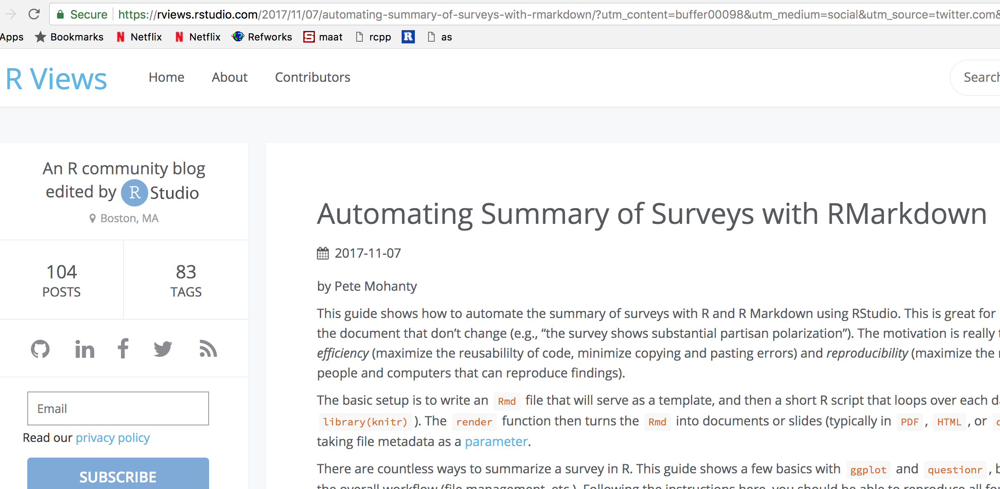
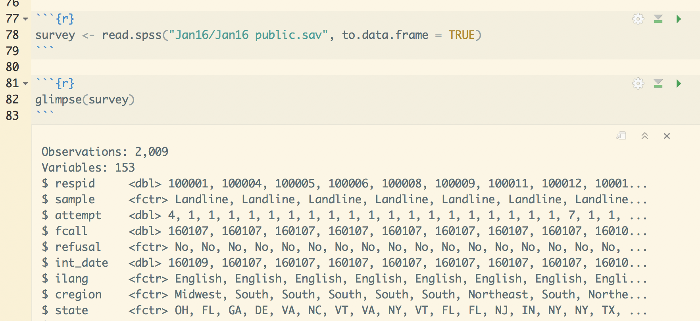
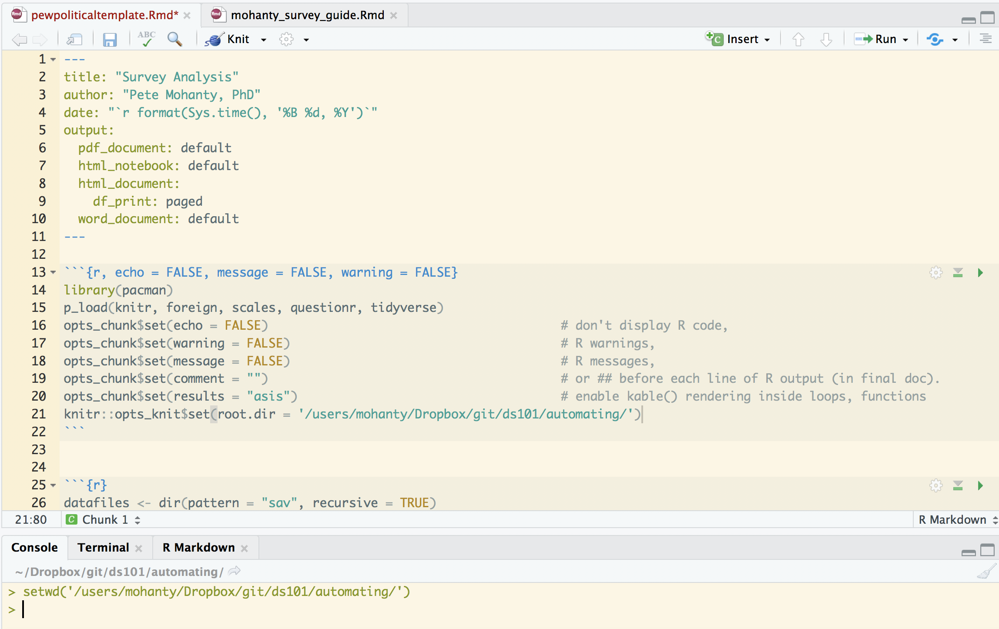
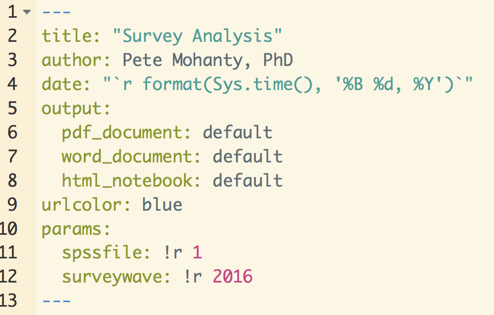
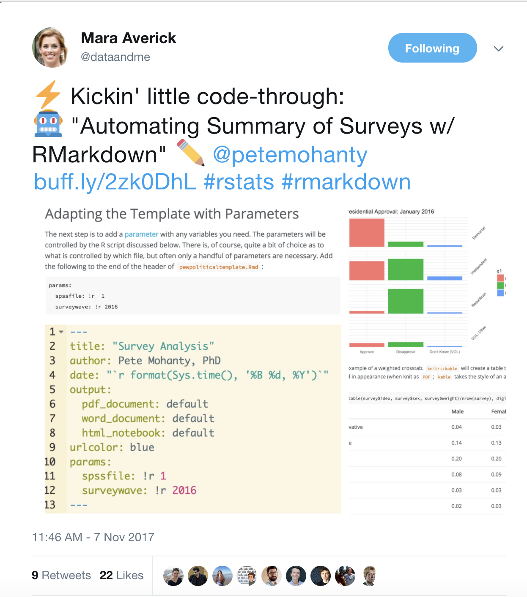

```{r, echo = FALSE, message = FALSE, warning = FALSE}
library(pacman)                            
p_load(knitr, foreign, tidyverse, questionr, sessioninfo)
opts_chunk$set(warning = FALSE,                          # don't display warnings
               message = FALSE,                          # or messages
               comment = "",                             # get rid of ## before R output
               tidy = TRUE,
               asis = TRUE,
               root.dir = '/users/mohanty/Dropbox/git/ds101/automating/',
               fig.path = 'images/')
```

# Tonight's Code via RViews: [http://bit.ly/2AE6En3](https://rviews.rstudio.com/2017/11/07/automating-summary-of-surveys-with-rmarkdown/?utm_content=buffer00098&utm_medium=social&utm_source=twitter.com&utm_campaign=buffer)

{height=400px, width=800px}

<style>
  .col2 {
    columns: 2 200px;         /* number of columns and width in pixels*/
    -webkit-columns: 2 200px; /* chrome, safari */
    -moz-columns: 2 200px;    /* firefox */
    text-align: center;
</style>


# Motivation

<div class="col2">
>- *Efficiency*: maximize the reusabililty of code, minimize copying and pasting errors  
>- *Reproducibility*: maximize the number of people + computers that can reproduce findings

>- {height=400px}  
XKCD 1319
</div>

# the Recipe

<div class="col2">
>- {height=400px}  
Create a template
>- {height=400px}  
Write a loop
</div>

# Software--seriously, keep up-to-date


```{r, eval = FALSE}
install.packages("pacman")
p_load(rmarkdown, knitr, questionr, tidyverse, sessioninfo, update = TRUE)
```

Make sure **RStudio** is new enough to get previews  

{height=300px}


# the Data

My guide works with four Pew Research Political Surveys: January, March, August, and October 2016. Data are free and easy to download (but account is required).

{width=1000px}


# Configuring the RMarkdown Template

{height=500px}

# Building the Template

### The Template

I find it easiest to write a fully working example and then make little changes as needed so that `knitr::render()` can loop over the data sets. First things first. 

```{r}
survey <- read.spss("Jan16/Jan16 public.sav", to.data.frame = TRUE)
```

```{r, echo = FALSE}
survey_date <- survey$int_date %>% as.character %>% as.Date("%y%m%d") %>% format("%B %Y") %>% unique

x <- names(survey)[grep("q2[[:digit:]]",  names(survey))]
y <- c("ideo", "party")
levels(survey[["ideo"]])[4] <- "Liberal"

levels(survey[["party"]])[4] <- "None"
levels(survey[["party"]])[5] <- "Other"

for(i in c(x, y)){
  
  levels(survey[[i]]) <- gsub("[^[:alnum:] ]", "", levels(survey[[i]]))
  
  v <- grep("VOL", levels(survey[[i]]))
  levels(survey[[i]]) <- gsub("VOL ", "", levels(survey[[i]]))
  levels(survey[[i]]) <- gsub("OR", "", levels(survey[[i]]))
  levels(survey[[i]])[grep("Refused", levels(survey[[i]]))] <- "DK"
  levels(survey[[i]])[grep("early", levels(survey[[i]]))] <- "Too early"
  levels(survey[[i]])[grep("Neither", levels(survey[[i]]))] <- "Other"
  
  for(j in v){
     levels(survey[[i]])[j] <- paste0(levels(survey[[i]])[j], "*")
  }
}
levels(survey$q1)[3] <- "Don't Know (VOL)"
tmp <- as.character(survey$party)
survey$party.clean <- ifelse(tmp %in% levels(survey$party)[1:3], tmp, "VOL: Other")

survey$race <- survey$racethn
levels(survey$race) <- gsub(" non-Hispanic", " (nH)", levels(survey$race)) 
levels(survey$race)[5] <- "DK*"
```

Summary stats can easily be inserted into the text like so.


# Making Tables with Kable

```{r}
kable(wtd.table(survey$ideo, survey$sex, survey$weight)/nrow(survey), digits = 2)
```

# Using Kable in a Loop

```{r}
x <- names(survey)[grep("q2[[:digit:]]",  names(survey))]
x
y <- c("ideo", "party")
```

```{r, eval = FALSE}

for(i in x){
  for(j in y){
    cat("\nWeighted counts for", i, "broken down by", j, "\n")
    print(kable(wtd.table(survey[[i]], survey[[j]], survey$weight)))            # requires asis=TRUE
    cat("\n")                                                        # break out of table formatting
  }
  cat("\\newpage")
}
```

# Adding a plot

```{r ggPresApproval, fig.height=3}
PA <- ggplot(survey) + geom_bar(aes(q1, y = (..count..)/sum(..count..), weight = weight, fill = q1)) + facet_grid(party.clean ~ .)
PA <- PA + theme_minimal() + theme(strip.text.y = element_text(angle = 45)) + xlab("") + scale_y_continuous(labels = scales::percent) + ylab("Percent of Country") + ggtitle("Presidential Approval: January 2016")
PA
```

# Adapting the Template with Parameters

The next step is to add a [parameter](http://rmarkdown.rstudio.com/developer_parameterized_reports.html) with any variables you need. The parameters will be controlled by the `R` script discussed in a moment. 

```
params:
  spssfile: !r  1
  surveywave: !r 2016
```

{height=300px}

# Parameterizing (cont'd)

```{r, eval = FALSE}
PA <- PA + ggtitle(paste("Presidential Approval:", params$surveywave))
```

```{r}
dir(pattern = ".sav", recursive = TRUE)
```

{height=200px}

# Automating with knitr

```{r, eval = FALSE}
library(pacman)
p_load(knitr, rmarkdown, sessioninfo) 

setwd("/users/mohanty/Desktop/pewpolitical/")

waves <- c("August 2016", "January 2016", "March 2016", "October 2016")   # for ggtitle, etc.

for(i in 1:length(waves)){
  render("pewpoliticaltemplate.Rmd", 
         params = list(spssfile = i,
                       surveywave = waves[i]),
         output_file = paste0("Survey Analysis ", waves[i], ".pdf"))
}

session <- session_info()
save(session, file = paste0("session", format(Sys.time(), '%m%d%Y'), ".Rdata"))
```

# A Little Version Control

If a package stops working `install_version` (from `library(devtools)`) installs older versions.

```{r}
s <- session_info()
s$platform$version
s$platform$os
head(s$packages)
```

# Thanks! 

{width=500px}


