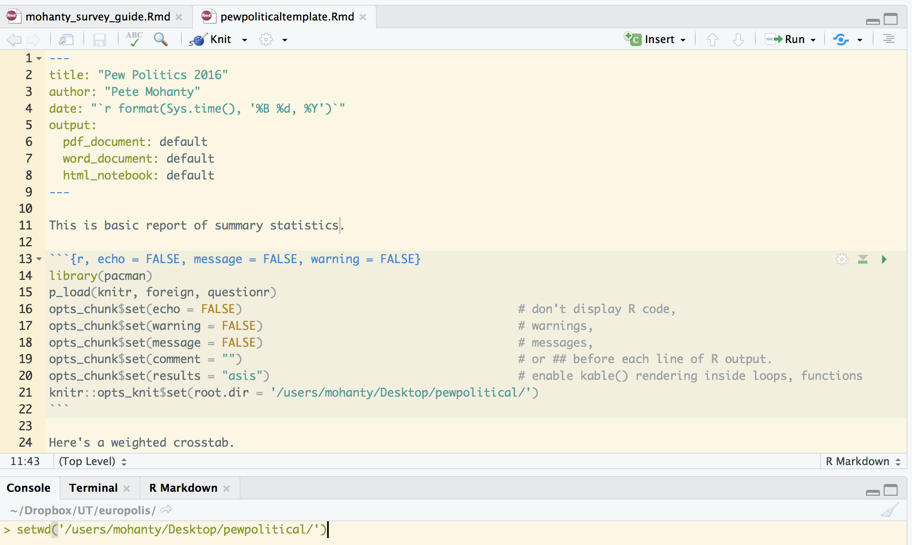
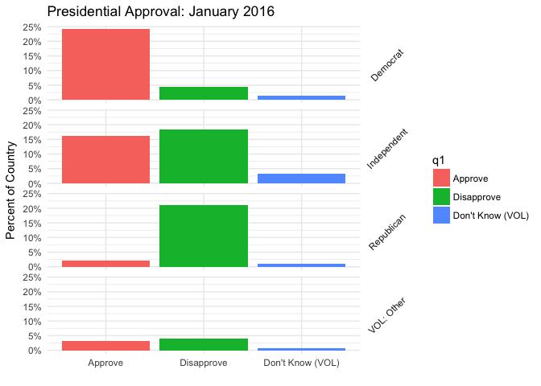
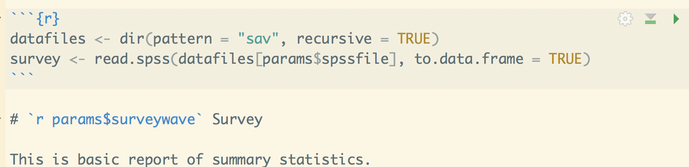

# Automating Summary of Surveys with RMarkdown
Pete Mohanty  

This guide is shows how to automate the summary of surveys with `R` and `RMarkdown` using `RStudio`. The basic setup is to write an `Rmd` file that will serve as a template and then a short script that (using `library(knitr)`) loops over each data file. This is great for portions of the document that don't change (e.g., "the survey shows substantial partisan polarization"). The `render` function then turns the `Rmd` into a `PDF` (or `HTML` or `docx` as desired), taking additional metadata about the data set as a "parameter" ([RStudio guide](http://rmarkdown.rstudio.com/developer_parameterized_reports.html)). There are countless ways to summarize a survey in `R`. This guide will show a few basics with `ggplot` and `questionr` but focus on the overall workflow (file management, etc.).  

Following the instructions here, you should be able to reproduce all four reports (and in principle, many more) despite only writing code to clean one survey. Almost all of the code that you need is found in this file, though some additional data cleaning code is found only in `pewpoliticaltemplate.Rmd`. The file that then loops over the available data sets is `pew_report_generator.R`.


# Software

`RStudio`'s interface with `rmarkdown` is evolving rapidly. Installing the current `RStudio` is highly recommended, particularly for the previews of the R markdown code (this doc was created with `1.1.83`). (Here is my [install guide](stats101.stanford.edu), which includes links to tutorials and cheat sheets. For somewhat more advanced survey data cleaning, click [here](stats101.stanford.edu/R_skill_dRill.html).) Note that this document has been created with `Pandoc 1.19.2.4`, not the brand new `2.0`, which seems to have a few minor compability issues with `rmarkdown`.

Even if you've knit R Markdowns in the past, your libraries may not be new enough to create parameterized reports. Install `pacman`, which has a convenience function `p_load` that smoothes package installation, loading, and maintenance.   


```r
install.packages("pacman")
p_load(rmarkdown, knitr, foreign, questionr, tidyverse, update = TRUE)
```


# The Data

Download the four "political surveys" from Pew Research available [here](http://www.people-press.org/datasets/2016/) (i.e., January, March, August, and October 2016). You may recall, some politics happened in 2016.

- If need be, decompress each `zip` folder.

Three of my folders have intuitive names (`Jan16`, `Mar16`, and `Oct16`) but one of my folders picked up a lengthy name, `http___www.people-press.org_files_datasets_Aug16`. Don't worry about that.

- Create a new folder, call it say `pewpolitical`

- Move all four folders into `pewpolitical`

Please note I have no affiliation (past or present) with Pew Research. I simply think that they do great work and they make it relatively hassle free to get started with meaningful data sets.

# The R Notebook (R Markdown) Template

In `RStudio`, create a new `RNoteook` and save it as `pewpoliticaltemplate.Rmd` in the `pewpolitical` folder you just created. This document will likely knit to `HTML` by default; hold down the `knit` button to change it to `PDF`. Add fields to the header as desired. Below find a sample header that automatically puts today's date on the document. (Remember `PDF` requires `LaTeX` [(install links)](stats101.stanford.edu). By contrast, knitting to `docx` or `HTML` does not require `LaTeX`. Creating `pptx` is possible with `R` with `library(ReporteRs)`.)

Next add an `R` code chunk to `pewpoliticaltemplate.Rmd` to take care of background stuff like formatting. Though setting a working directory would not be needed just to knit the `Rmd`, it must be set by `knit::opts_knits$set(root.dir = '/path/to/pewpolitical/')` to automate document prep. (`setwd` isn't needed in the `Rmd` but setting the working directory separately in `Console` is recommended if you're still editing.)




Now the default settings have been set and you don't need to worry about suppressing warnings and so on with each code chunk. You can of course change them case-by-case as you like. 

-- Unlike in `R`, when setting the format options for individual code chunks (as shown above to suppress warnings before the defaults kick in), you do need to type out the words `TRUE` and `FALSE` in full. 

-- In this document, by constrast, I've set the defaults to `echo = TRUE` and `tidy = TRUE` to display the R code more pleasingly.

-- The setting `asis = TRUE` is very useful for professionally formatted tables (show below) but is not recommendable for raw R output of matrix and tables.

### The Template

I find it easiest to write a fully working example and then make little changes as needed so that `knitr::render()` can loop over the data sets. First things first. 


```r
survey <- read.spss("Jan16/Jan16 public.sav", to.data.frame = TRUE)
```


Here is a basic plot we might want, which reflects the survey weights. `facet_grid()` is used to create analogous plots for each party identification. The plot uses the slightly wonky syntax `y = (..count..)/sum(..count..)` to display the results as percentages rather than counts. Note some code that cleans the data (mostly shortening labels) is omitted for brevity but can be found [here](https://github.com/rdrr1990/datascience101/blob/master/automating/pewpoliticaltemplate.Rmd).


```r
PA <- ggplot(survey) + theme_minimal()
PA <- PA + geom_bar(aes(q1, y = (..count..)/sum(..count..), weight = weight, 
    fill = q1))
PA <- PA + facet_grid(party.clean ~ .) + theme(strip.text.y = element_text(angle = 45))
PA <- PA + xlab("") + ylab("Percent of Country")
PA <- PA + ggtitle("Presidential Approval: January 2016")
PA <- PA + scale_y_continuous(labels = scales::percent)
PA
```

<!-- -->

\newpage

Here is an example of a weighted crosstab. `knitr::kable` will create a table that's professional in appearance (when knit as `PDF`, `kable` takes the style of an academic journal).


```r
kable(wtd.table(survey$ideo, survey$sex, survey$weight)/nrow(survey), digits = 2)
```

                     Male   Female
------------------  -----  -------
Very conservative    0.04     0.03
Conservative         0.14     0.13
Moderate             0.20     0.20
Liberal              0.08     0.09
Very liberal         0.03     0.03
DK*                  0.02     0.03

Suppose we want to do many crosstabs. The syntax `survey$ideo` is widely used for convenience but `survey[["ideo"]]` will serve us better since it allow to work with vectors of variable names ([details from win-vector](http://www.win-vector.com/blog/2017/06/non-standard-evaluation-and-function-composition-in-r/)). Below, the first two calls to comparisons are identical but the final one is not because there is no variable "x" in the data frame `survey`.


```r
identical(survey$ideo, survey[["ideo"]])
```

```
[1] TRUE
```

```r
x <- "ideo"
identical(survey[[x]], survey[["ideo"]])
```

```
[1] TRUE
```

```r
identical(survey[[x]], survey$x)
```

```
[1] FALSE
```

So suppose we want weighted crosstabs for ideology and party id crossed by all question 20, 21, 22.. 30. Here is some code that will do that. 


```r
x <- names(survey)[grep("q2[[:digit:]]", names(survey))]
x
```

```
 [1] "q20"  "q21"  "q22a" "q22b" "q22c" "q22d" "q22e" "q22f" "q22g" "q22h"
[11] "q22i" "q25"  "q26"  "q27"  "q28" 
```

```r
y <- c("ideo", "party")
```


```r
for (i in x) {
    for (j in y) {
        cat("\nWeighted proportions for", i, "broken down by", j, "\n")
        print(kable(wtd.table(survey[[i]], survey[[j]], survey$weight)/nrow(survey), 
            digits = 2))
        cat("\n")  # break out of table formatting
    }
    cat("\\newpage")
}
```

A few notes:

  -- This code will only work with the `asis` setting (shown above) that lets `knitr` interpret the output of print(kable()) as something to render (rather just Markdown code to display that could be copy and pastied elsewhere).  
  
  -- Ideally one would have a `csv` or `data.frame` of the questions and display the as loop switched questions. In this case, the questionnaire is in a `docx` and so `library(docxtrackr)` may help.  
  
  -- Rather than a nested loop, one would likely prefer to pick a question, loop over the demographic and ideological categories for the crosstabs, and then insert commentary and overview.  
  
  -- The outer loops makes a new page each time it is done with the inner loop with `cat("\\newpage"))`, which is specific to making `PDF`s. Extra line breaks `\n` are needed to break out of the table formatting and keep code and text separate. A different approach to page breaks is needed [for docx](https://stackoverflow.com/questions/24672111/how-to-add-a-page-break-in-word-document-generated-by-rstudio-markdown).

# Adapting the Template with Parameters

The next step is to add a [parameter](http://rmarkdown.rstudio.com/developer_parameterized_reports.html) with any variables you need. The parameters will be controlled by the `R` script discussed below. There is of course quite a bit of choice as to what is controlled by which file. Add the following to the end of the header of `pewpoliticaltemplate.Rmd`:

```
params:
  spssfile: !r  1
  surveywave: !r 2016
```


That creates variables `params$spssfile` and `params$surveywave` that can be controlled externally from other `R` sessions and gives them default values of `1` and `2016`. Setting default values smooths debugging by allowing you to continue knitting the `Rmd` on its own (as opposed to from the `R` script we will create in a moment... You can also click on `knit` and choose `knit with parameters` to specify particular values).

Now make any changes to `Rmd` template. For example, in the `ggplot` code...


```r
PA <- PA + ggtitle(paste("Presidential Approval:", params$surveywave))
```


Notice we can get a list of all the `spss` files like so:


```r
dir(pattern = "sav", recursive = TRUE)
```

```
[1] "http___www.people-press.org_files_datasets_Aug16/Aug16 public.sav"
[2] "Jan16/Jan16 public.sav"                                           
[3] "March16/March16 public.sav"                                       
[4] "Oct16/Oct16 public.sav"                                           
```
or in this case

```r
dir(pattern = "public.sav", recursive = TRUE)
```

```
[1] "http___www.people-press.org_files_datasets_Aug16/Aug16 public.sav"
[2] "Jan16/Jan16 public.sav"                                           
[3] "March16/March16 public.sav"                                       
[4] "Oct16/Oct16 public.sav"                                           
```
I recommend making the pattern as specific as possible in case you or your collaborators add other `spss` files with similar names. To use regular expressions to specify more complicated patterns, see [here](https://rstudio-pubs-static.s3.amazonaws.com/74603_76cd14d5983f47408fdf0b323550b846.html). 

Now back to editing `pewpoliticaltemplate.Rmd`...



Knit the file to see how it looks with these default settings; that\'s it for this portion.

# Automating with knitr
  
Now create a new `R` script; mine\'s called `pew_report_generator.R`. It\'s just a simple loop that tells which data set to grab as well as the label to pass to the `Rmd`. Note that the labels appear in alphabetical rather than chronological order as a function of the way that the `Rmd` happens to find the files.


```r
library(pacman)
p_load(knitr, rmarkdown, sessioninfo)

setwd("/users/mohanty/Desktop/pewpolitical/")

waves <- c("August 2016", "January 2016", "March 2016", "October 2016")

for (i in 1:length(waves)) {
    render("pewpoliticaltemplate.Rmd", params = list(spssfile = i, surveywave = waves[i]), 
        output_file = paste0("Survey Analysis ", waves[i], ".pdf"))
}

session <- session_info()
save(session, file = paste0("session", format(Sys.time(), "%m%d%Y"), ".Rdata"))
```

The last bit of code is not necessary but is a convenient way to store which versions of which libraries were actually used. If something works now but not in the future `install_version` (found in `library(devtools)`) can be used to install the older version of particular packages.  

That\'s it. Of course, in practice you might write some code on the first survey that doesn\'t work for all of them. Pew, for example, seems to have formatted the survey date differently in the last two surveys which made me change the way displayed which survey we are looking at. But if the data are formatted consistently, a one time investment in modifying your `Rmd` and creating an extra `R` file can save massive amounts of time lost to error prone copying and pasting.


```r
s <- session_info()
s$platform
```

```
 setting  value                       
 version  R version 3.4.2 (2017-09-28)
 os       macOS Sierra 10.12.6        
 system   x86_64, darwin15.6.0        
 ui       X11                         
 language (EN)                        
 collate  en_US.UTF-8                 
 tz       America/Los_Angeles         
 date     2017-10-30                  
```

```r
s$packages
```

```
 package     * version date       source                          
 assertthat    0.2.0   2017-04-11 CRAN (R 3.4.0)                  
 backports     1.1.1   2017-09-25 CRAN (R 3.4.2)                  
 bindr         0.1     2016-11-13 CRAN (R 3.4.0)                  
 bindrcpp      0.2     2017-06-17 CRAN (R 3.4.0)                  
 broom         0.4.2   2017-02-13 CRAN (R 3.4.0)                  
 cellranger    1.1.0   2016-07-27 CRAN (R 3.4.0)                  
 clisymbols    1.2.0   2017-05-21 cran (@1.2.0)                   
 colorspace    1.3-2   2016-12-14 CRAN (R 3.4.0)                  
 digest        0.6.12  2017-01-27 CRAN (R 3.4.0)                  
 dplyr       * 0.7.4   2017-09-28 cran (@0.7.4)                   
 evaluate      0.10.1  2017-06-24 CRAN (R 3.4.1)                  
 forcats       0.2.0   2017-01-23 CRAN (R 3.4.0)                  
 foreign     * 0.8-69  2017-06-22 CRAN (R 3.4.2)                  
 formatR       1.5     2017-04-25 CRAN (R 3.4.0)                  
 ggplot2     * 2.2.1   2016-12-30 CRAN (R 3.4.0)                  
 glue          1.2.0   2017-10-29 CRAN (R 3.4.2)                  
 gtable        0.2.0   2016-02-26 CRAN (R 3.4.0)                  
 haven         1.1.0   2017-07-09 CRAN (R 3.4.1)                  
 highr         0.6     2016-05-09 CRAN (R 3.4.0)                  
 hms           0.3     2016-11-22 CRAN (R 3.4.0)                  
 htmltools     0.3.6   2017-04-28 CRAN (R 3.4.0)                  
 httpuv        1.3.5   2017-07-04 CRAN (R 3.4.1)                  
 httr          1.3.1   2017-08-20 cran (@1.3.1)                   
 jsonlite      1.5     2017-06-01 CRAN (R 3.4.0)                  
 knitr       * 1.17    2017-08-10 CRAN (R 3.4.1)                  
 labeling      0.3     2014-08-23 CRAN (R 3.4.0)                  
 lattice       0.20-35 2017-03-25 CRAN (R 3.4.2)                  
 lazyeval      0.2.1   2017-10-29 CRAN (R 3.4.2)                  
 lubridate     1.7.0   2017-10-29 CRAN (R 3.4.2)                  
 magrittr      1.5     2014-11-22 CRAN (R 3.4.0)                  
 mime          0.5     2016-07-07 CRAN (R 3.4.0)                  
 miniUI        0.1.1   2016-01-15 CRAN (R 3.4.0)                  
 mnormt        1.5-5   2016-10-15 CRAN (R 3.4.0)                  
 modelr        0.1.1   2017-07-24 CRAN (R 3.4.1)                  
 munsell       0.4.3   2016-02-13 CRAN (R 3.4.0)                  
 nlme          3.1-131 2017-02-06 CRAN (R 3.4.2)                  
 pacman      * 0.4.6   2017-05-14 CRAN (R 3.4.0)                  
 pkgconfig     2.0.1   2017-03-21 CRAN (R 3.4.0)                  
 plyr          1.8.4   2016-06-08 CRAN (R 3.4.0)                  
 psych         1.7.8   2017-09-09 CRAN (R 3.4.1)                  
 purrr       * 0.2.4   2017-10-18 CRAN (R 3.4.2)                  
 questionr   * 0.6.1   2017-06-20 CRAN (R 3.4.1)                  
 R6            2.2.2   2017-06-17 CRAN (R 3.4.0)                  
 Rcpp          0.12.13 2017-09-28 cran (@0.12.13)                 
 readr       * 1.1.1   2017-05-16 CRAN (R 3.4.0)                  
 readxl        1.0.0   2017-04-18 CRAN (R 3.4.0)                  
 reshape2      1.4.2   2016-10-22 CRAN (R 3.4.0)                  
 rlang         0.1.2   2017-08-09 CRAN (R 3.4.1)                  
 rmarkdown     1.6     2017-06-15 CRAN (R 3.4.0)                  
 rprojroot     1.2     2017-01-16 CRAN (R 3.4.0)                  
 rstudioapi    0.7     2017-09-07 cran (@0.7)                     
 rvest         0.3.2   2016-06-17 CRAN (R 3.4.0)                  
 scales        0.5.0   2017-08-24 cran (@0.5.0)                   
 sessioninfo * 1.0.0   2017-06-21 CRAN (R 3.4.1)                  
 shiny         1.0.5   2017-08-23 cran (@1.0.5)                   
 stringi       1.1.5   2017-04-07 CRAN (R 3.4.0)                  
 stringr       1.2.0   2017-02-18 CRAN (R 3.4.0)                  
 tibble      * 1.3.4   2017-08-22 cran (@1.3.4)                   
 tidyr       * 0.7.2   2017-10-16 CRAN (R 3.4.2)                  
 tidyverse   * 1.1.1   2017-01-27 CRAN (R 3.4.0)                  
 withr         2.0.0   2017-10-25 Github (jimhester/withr@a43df66)
 xml2          1.1.1   2017-01-24 CRAN (R 3.4.0)                  
 xtable        1.8-2   2016-02-05 CRAN (R 3.4.0)                  
 yaml          2.1.14  2016-11-12 CRAN (R 3.4.0)                  
```


```

```
